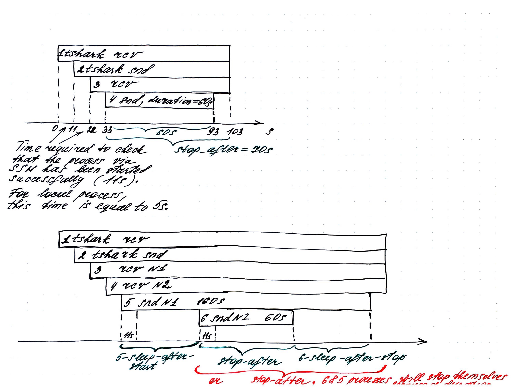

# Experiment Config Demystified

## Experiment Config and Task Concept

An experiment config is a `.json` file consisting of the following fields:

- `collect_results_path`: Path to the directory where experimental results are collected.
- `stop_after`: Time after which an experiment will be stopped, in seconds.
- `ignore_stop_order`: `true` if stopping order of tasks will be ignored when stopping an experiment.
- `tasks`: Tasks to run within an experiment and their configs listed in starting order.

```
{
    "collect_results_path": "_experiment_results",
    "stop_after": 70,
    "ignore_stop_order": true,
    "tasks": {
        "1": {...},
        "2": {...},
        ...
    }
}
```

A task represents one step of a single experiment and contains both information about an object to run (e.g., `thark` or `srt-xtransmit` application) and where to run the object (e.g., locally or on a remote machine). A task config also contains information about the time to sleep after the object starts or stops, and the stopping order. However, those fields are optional and should be set to `null` if not defined.

Here is an example of task config:

```
"1": {
    "obj_type": "srt-xtransmit",
    "obj_config": {...},
    "runner_type": "remote-runner",
    "runner_config": {...},
    "sleep_after_start": null,
    "sleep_after_stop": null,
    "stop_order": null
}
```

where

- `obj_type`: Object to run. Currently `tshark` and `srt-xtransmit` applications are supported.
- `obj_config`: Object config that helps to build a command line for a Python subprocess.
- `runner_type`: Object runner to use. `local-runner` should be used to run the object locally and `remote-runner` - on a remote machine via SSH.
- `runner_config`: Object runner config.
- `sleep_after_start`: Time to sleep after object start, in seconds. Optional, must be `null` if not defined.
- `sleep_after_stop`: Time to sleep after object stop, in seconds. Optional, must be `null` if not defined.
- `stop_order`: The stopping order of tasks. Optional, must be `null` if not defined. By default, tasks will be stopped in reverse order.

## Experiment Description

A typical experiment consists of the following tasks:
1. Start `tshark` locally or remotely via SSH on a receiver (optional).
2. Start `tshark` locally or remotely via SSH on a sender (optional).
3. Start `srt-xtransmit` test application (or another test application with SRT support), receiver, locally or remotely via SSH.
4. Start `srt-xtransmit` test application (or another test application with SRT support), sender, locally or remotely via SSH.

Adding or deleting tasks under the `tasks` field of an experiment config changes the logic of the experiment.

Once all the tasks have been started, the script sleeps for `stop_after` seconds to wait for the SRT sender to finish transmission and then stops the experiment.

After stopping the tasks, the script collects experiment artifacts (SRT `.csv` statistics, a file with metrics produced by the `srt-xtransmit` receiver, `.pcapng` dumps generated by `tshark`) and writes them to the machine where the script is running.

NOTE: `--duration` option of the `srt-xtransmit` application is used to control the time of data transmission. A particular value should be specified in the appropriate task config &#8594; object config `obj_config` &#8594; `options_values`. If `--duration` option is not set, script sleeps for `stop_after` seconds and then stops the experiment. In this case `srt-xtransmit` sender will be generating data without any time limitation and then will be stopped by the script as well as the other tasks.

Here is an example of experiment timeline:



## Supported Object Runners and Their Configs

### local-runner

For `local-runner` the config is empty `{}`:

```
"runner_type": "local-runner",
"runner_config": {},
```

### remote-runner

```
"runner_type": "remote-runner",
"runner_config": {
    "username": "msharabayko",
    "host": "10.129.10.92"
},
```

- `username`: Username on the remote machine involved in the experiment.

- `host`: IP address of the remote machine involved in the experiment.

## Supported Objects and Their Configs

### tshark

**Config Example**

```
"obj_type": "tshark",
"obj_config": {
    "path": "tshark",
    "interface": "en0",
    "port": "4200",
    "tracefile_path": "_tmp/snd-tracefile.pcapng"
},
```

- `path`: Path to `tshark` application.

- `interface`: Interface to listen and capture the traffic.

- `port`: Port to listen and capture the traffic.

- `tracefile_path`: Filepath to store output .pcapng trace file.

**Example Commands**

- When running with `local-runner`:
  `tshark -i en0 -f "udp port 4200" -s 1500 -w _tmp/snd-tracefile.pcapng`

- When running with `remote-runner`:
  `ssh -tt -o BatchMode=yes -o ConnectTimeout=10 msharabayko@10.129.10.92 'tshark -i eth0 -f "udp port 4200" -s 1500 -w _tmp/snd-tracefile.pcapng'`

### srt-xtransmit

**Config Example**

```
"obj_type": "srt-xtransmit",
"obj_config": {
    "type": "rcv",
    "path": "/home/haivision/projects/maria/srt-xtransmit/_build/bin/srt-xtransmit",
    "port": "4200",
    "attrs_values": {
        "rcvbuf": "1000000000",
        "sndbuf": "1000000000",
        "latency": "400"
    },
    "options_values": {
        "--msgsize": "1316",
        "--statsfile": "/home/haivision/projects/maria/_tmp/rcv-srt-stats.csv",
        "--statsfreq": "1s",
        "--enable-metrics": null,
        "--metricsfile": "/home/haivision/projects/maria/_tmp/rcv-srt-metrics.csv"
    }
}
```

- `type`: Type of the application as per `SrtApplicationType`. Currently `snd` and `rcv` types are supported.

- `path`: Path to `srt-xtransmit` application.

- `port`: Port to listen/call to.

- `host`: Host to call to. Optional.

- `attrs_values`: SRT URI attributes of the following format:
  ```
  {
      "attr1": "value1",
      "attr2": "value2",
      ...
  }
  ```

  Optional.

- `options_values`: Application options of the following format:
  ```
  {
      "option1": "value1",
      "option2": "value2",
      ...
  }
  ```

  Optional.

**Example Commands**

- When running with `local-runner`:
  `/home/haivision/projects/maria/srt-xtransmit/_build/bin/srt-xtransmit receive "srt://:4200?rcvbuf=1000000000&sndbuf=1000000000&latency=400" --msgsize 1316 --statsfile /home/haivision/projects/maria/_tmp/rcv-srt-stats.csv --statsfreq 1s --enable-metrics --metricsfile /home/haivision/projects/maria/_tmp/rcv-srt-metrics.csv`

- When running with `remote-runner`:
  `ssh -tt -o BatchMode=yes -o ConnectTimeout=10 msharabayko@10.129.10.92 '/home/haivision/projects/maria/srt-xtransmit/_build/bin/srt-xtransmit receive "srt://:4200?rcvbuf=1000000000&sndbuf=1000000000&latency=400" --msgsize 1316 --statsfile /home/haivision/projects/maria/_tmp/rcv-srt-stats.csv --statsfreq 1s --enable-metrics --metricsfile /home/haivision/projects/maria/_tmp/rcv-srt-metrics.csv'`

## Config Files Summary

| Config                                                       | Description                                                  |
| ------------------------------------------------------------ | ------------------------------------------------------------ |
| [config_1](config_1.json)                                    | Remote-Remote setup. Running `srt-xtransmit` on 2 remote machines. Collecting SRT `.csv` statistics produced by `srt-xtransmit` from both machines and a file with metrics generated on the receiver side. |
| [config_2](config_2.json)                                    | Remote-Remote setup. Running `tshark` and `srt-xtransmit` on 2 remote machines. Collecting `.pcapng` trace files from both machines in addition to SRT statistics and `srt-xtransmit` metrics. |
| [config_3](config_3.json)                                    | Local-Remote setup. The same idea as in [config_1](config_1.json) where receiver is run remotely and sender - locally. |
| [config_4](config_4.json)                                    | Local-Local setup. The same idea as in [config_1](config_1.json) where both receiver and sender are run locally. |
